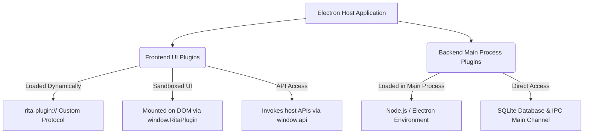

# Rita POS & ERP Plugin Development Guide

This guide provides a comprehensive walkthrough for developing, testing, and installing custom plugins for the Rita Sales Reports / POS application, particularly when the application is already running in production.

---

## 1. Plugin Architecture Overview

Rita supports a **dual plugin architecture** designed to safely extend both the user interface and background services:



1. **Frontend UI Plugins**:
   - Sandboxed React components dynamically loaded into the renderer process in production.
   - Served securely via a custom, CSP-compliant protocol (`rita-plugin://`).
   - Packaged as a standard ZIP file containing a `manifest.json` and a compiled bundle (`dist/plugin.js`).
   
2. **Backend/Main Process Plugins**:
   - Standard Node.js modules loaded during the main process boot sequence.
   - Run with full system privileges, allowing direct access to the SQLite database (`store.db`), hardware integrations (like ESC/POS receipt printers), and background sync workers.

---

## 2. Developing Frontend UI Plugins

Frontend plugins are written in React and TypeScript/JavaScript. They are built as Immediately Invoked Function Expressions (IIFE) and must dynamically register themselves with the host.

### A. Directory Structure
A typical frontend plugin directory looks like this:
```text
my-custom-plugin/
├── manifest.json
├── package.json
├── vite.config.js
└── src/
    └── index.tsx
```

### B. The Plugin Manifest (`manifest.json`)
The manifest registers your plugin with the host application's database. It defines UI labels, role permissions, and entry points:

```json
{
  "id": "rita-plugin-custom-loyalty",
  "name": "Custom Loyalty Program",
  "description": "Manage points, rewards, and customer campaigns.",
  "version": "1.0.0",
  "icon": "Gift",
  "iconBg": "#db2777",
  "gradient": "linear-gradient(135deg, #fce7f3 0%, #fbcfe8 100%)",
  "roles": [
    "Admin",
    "Manager",
    "Cashier"
  ],
  "entryFile": "dist/plugin.js"
}
```

#### Manifest Fields:
- **`id`**: Unique string identifier (must match the name of the folder when extracted).
- **`name`**: Display name in the App Switcher.
- **`description`**: Brief description shown to administrators.
- **`version`**: Semantic versioning string.
- **`icon`**: Name of a [Lucide Icon](https://lucide.dev/icons) (e.g., `ShoppingBag`, `Utensils`, `Gift`).
- **`iconBg`**: Background color hex code for the switcher icon badge.
- **`gradient`**: CSS gradient background applied to the App Switcher card.
- **`roles`**: User roles authorized to launch this plugin (e.g., `Admin`, `Manager`, `Cashier`, `Waiter`, `Staff`).
- **`entryFile`**: Relative path to the production JavaScript bundle file.

### C. The Lifecycle Entry Point (`src/index.tsx`)
Because the host application already runs React and ReactDOM, your plugin **must not bundle React**. Doing so increases bundle size and breaks React context/hooks. Instead, use the global React references exposed by the host.

Your entry point must register `mount` and `unmount` functions on `window.RitaPlugin`:

```tsx
// 1. Retrieve the host-provided React instance
const React = (window as any).React;

interface MountProps {
  onClose: () => void;
  api: any; // Host APIs exposed via IPC
  appProps?: any;
}

const LoyaltyApp: React.FC<MountProps> = ({ api, onClose, appProps }) => {
  const [customers, setCustomers] = React.useState<any[]>([]);
  const [loading, setLoading] = React.useState(true);

  React.useEffect(() => {
    // Call the host database API
    api.getCustomers()
      .then((data: any) => {
        setCustomers(data);
        setLoading(false);
      })
      .catch((err: any) => {
        console.error("Failed to fetch customers:", err);
        setLoading(false);
      });
  }, [api]);

  return (
    <div style={{ padding: '24px', background: '#fff', height: '100%', display: 'flex', flexDirection: 'column' }}>
      <div style={{ display: 'flex', justifyContent: 'space-between', alignItems: 'center', marginBottom: '20px' }}>
        <h1 style={{ color: '#db2777', margin: 0 }}>Loyalty Dashboard</h1>
        <button 
          onClick={onClose} 
          style={{ background: '#f1f5f9', border: 'none', padding: '8px 16px', borderRadius: '6px', cursor: 'pointer', fontWeight: 'bold' }}
        >
          Close Plugin
        </button>
      </div>

      {loading ? (
        <p>Loading customers...</p>
      ) : (
        <div>
          <h3>Registered Customers ({customers.length})</h3>
          <ul>
            {customers.map((c: any) => (
              <li key={c.id}>{c.name} (Points: {c.points || 0})</li>
            ))}
          </ul>
        </div>
      )}
    </div>
  );
};

// 2. Expose mount and unmount hooks to the window context
(window as any).RitaPlugin = {
  mount: (container: HTMLElement, props: MountProps) => {
    const ReactDOM = (window as any).ReactDOM;
    const root = ReactDOM.createRoot(container);
    root.render(React.createElement(LoyaltyApp, props));
    (window as any).RitaPlugin._root = root;
  },
  unmount: () => {
    const root = (window as any).RitaPlugin._root;
    if (root) {
      root.unmount();
    }
  }
};
```

### D. Build Settings (`vite.config.js`)
Build the plugin as a library with **IIFE format** and declare `react` and `react-dom` as external:

```javascript
import { defineConfig } from 'vite';
import react from '@vitejs/plugin-react';

export default defineConfig({
  plugins: [react()],
  build: {
    lib: {
      entry: 'src/index.tsx',
      name: 'loyaltyPlugin',
      formats: ['iife'],
      fileName: () => 'plugin.js'
    },
    rollupOptions: {
      external: ['react', 'react-dom'],
      output: {
        globals: {
          react: 'React',
          'react-dom': 'ReactDOM'
        }
      }
    }
  },
  define: {
    'process.env.NODE_ENV': '"production"'
  }
});
```

### E. Package Definition (`package.json`)
```json
{
  "name": "rita-plugin-custom-loyalty",
  "version": "1.0.0",
  "scripts": {
    "build": "vite build"
  },
  "devDependencies": {
    "@vitejs/plugin-react": "^4.2.0",
    "typescript": "^5.0.0",
    "vite": "^5.0.0"
  }
}
```

---

## 3. Developing Backend Main Process Plugins

Backend plugins can register main process IPC handlers, run periodic cron tasks, or hook directly into system events.

### A. Structure
A backend plugin is a standard Node.js/CommonJS module that exports a single initialization function:

```javascript
// C:\Users\<Username>\AppData\Roaming\<AppId>\plugins\loyalty.js

module.exports = function(app, ipcMain, store) {
  console.log("🌟 Custom Loyalty Backend Plugin Loaded!");

  // Create table if it doesn't exist
  try {
    store.db.prepare(`
      CREATE TABLE IF NOT EXISTS loyalty_points (
        customerId TEXT PRIMARY KEY,
        points INTEGER DEFAULT 0,
        updatedAt TEXT
      )
    `).run();
  } catch (e) {
    console.error("Failed to initialize loyalty table:", e);
  }

  // Register custom IPC handlers for the frontend to invoke
  ipcMain.handle('plugin:loyalty:getPoints', (event, customerId) => {
    try {
      const row = store.db.prepare('SELECT points FROM loyalty_points WHERE customerId = ?').get(customerId);
      return row ? row.points : 0;
    } catch (e) {
      console.error('Error fetching loyalty points:', e);
      return 0;
    }
  });

  ipcMain.handle('plugin:loyalty:addPoints', (event, customerId, pointsToAdd) => {
    try {
      store.db.prepare(`
        INSERT INTO loyalty_points (customerId, points, updatedAt) 
        VALUES (?, ?, datetime('now'))
        ON CONFLICT(customerId) DO UPDATE SET 
          points = points + excluded.points,
          updatedAt = excluded.updatedAt
      `).run(customerId, pointsToAdd);
      return true;
    } catch (e) {
      console.error('Error adding loyalty points:', e);
      return false;
    }
  });
};
```

---

## 4. Packing and Deploying Plugins to Production

Once your plugin is built, you can easily install it on a running production client.

### A. Frontend UI Plugins (via ZIP Installer)
1. In your plugin project directory, build the assets:
   ```bash
   npm run build
   ```
2. Compress the root directory of your plugin (containing `manifest.json` and the built `dist/plugin.js`) into a `.zip` archive.
   - *Ensure the `manifest.json` is at the top level of the archive, or inside a single root folder.*
3. Open the production **Rita** application.
4. Go to the **App Switcher** screen.
5. Click the **Install Plugin** button at the top-right.
6. Select your `.zip` file.
7. The application automatically:
   - Extracts the ZIP archive to `app.getPath('userData')/plugins/[plugin-id]`.
   - Scans the manifest.
   - Registers the plugin metadata in the database's `installed_modules` table.
   - Adds the new card to your App Switcher instantly.

### B. Backend Main Process Plugins (Manual Placement)
Because backend plugins run with full Node.js privileges, they cannot be installed directly via the frontend for security reasons. They must be manually deployed by a system administrator:
1. Locate the packaged application install directory on the target production computer.
2. In the folder containing the compiled Electron source code (usually `dist-electron`), locate or create a `plugins` subdirectory:
   - Windows: `C:\Users\<username>\AppData\Local\Programs\<AppName>\resources\app\dist-electron\plugins` (or similar depending on your installer configs).
   - Alternatively, place in the standard Electron main loader folder as configured.
3. Save your `.js` backend plugin file directly inside this directory.
4. Restart the application. The plugin will execute immediately on startup.

---

## 5. Security & CSP Compliance
To prevent cross-site scripting (XSS) issues while still allowing dynamic code loading, the host application configures a custom protocol and custom Content Security Policy (CSP):
- **Custom Protocol**: `rita-plugin://[plugin-id]/dist/plugin.js`
- **CSP Directive**:
  ```text
  default-src 'self' 'unsafe-inline' rita-plugin:;
  script-src 'self' 'unsafe-inline' 'unsafe-eval' rita-plugin:;
  connect-src 'self' http://localhost:* ws://localhost:* rita-plugin:;
  img-src 'self' data: blob: rita-plugin:;
  ```
Always compile your assets using the `rita-plugin://` prefix for custom assets, and fetch resources dynamically using `window.api` IPC channels.

---

## 6. Accessing Host APIs from the Frontend
Here are the most common APIs exposed to your plugin via the `api` parameter or `window.api`:

| API Call | Description |
|---|---|
| `api.getCustomers()` | Fetch list of all customers |
| `api.addCustomer(customer, userId)` | Create a new customer record |
| `api.getProducts()` | Get inventory product lists |
| `api.getSales()` | Fetch sales transaction lists |
| `api.getLowStockItems()` | Fetch products below inventory threshold |
| `api.getSetting(key)` | Get an application setting value |
| `api.setSetting(key, value)` | Update an application setting |

To execute custom backend actions, invoke your backend plugin's registered IPC channels:
```javascript
// In frontend plugin code
const points = await (window as any).api.ipcRenderer.invoke('plugin:loyalty:getPoints', customerId);
```
*(Ensure you expose `ipcRenderer` or your custom channels inside `electron/preload.ts` if adding novel IPC methods).*
