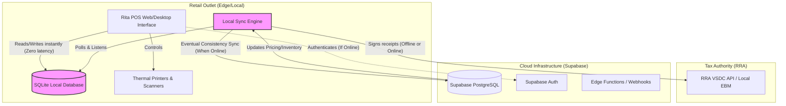
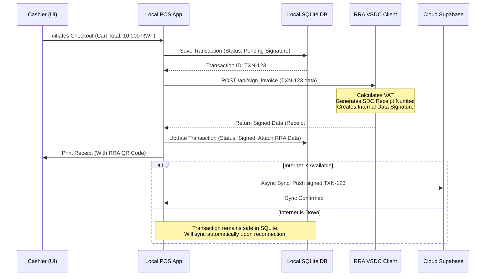

# Rita POS - Virtual Data Room (VDR) Architecture

This document contains the high-level technical architecture diagrams designed specifically to demonstrate the operational moat to venture capital investors during Due Diligence (Phase 5) and to be included in the Virtual Data Room (VDR) (Phase 1).

## 1. System Architecture: The Offline-First Moat

This diagram highlights how Rita POS guarantees 100% uptime regardless of internet connectivity, a critical competitive advantage in African markets.

### Investor Talking Points:
*   **Zero-Downtime:** The primary database is `SQLite Local`. Transactions never wait for a network request. 
*   **Guaranteed Compliance:** Tax signing happens locally via the Sync Engine before receipts are printed, meaning the merchant is always RRA compliant, even if the internet has been down for hours.
*   **Eventual Consistency:** When the network returns, the `SyncEngine` pushes all local changes to `Supabase` seamlessly, ensuring the central ERP remains the source of truth without being a bottleneck.

---

## 2. RRA VSDC Invoice Signing Flow

This sequence diagram details exactly how a transaction is secured and signed for tax compliance. This validates the deep technical expertise claimed in the Pitch Deck.

### Investor Talking Points:
*   **Regulatory Alignment:** Demonstrates exact compliance with RRA mandates, significantly de-risking the regulatory environment for investors.
*   **Auditability:** Shows exactly where the state of the transaction is held, proving that data loss is virtually impossible.
